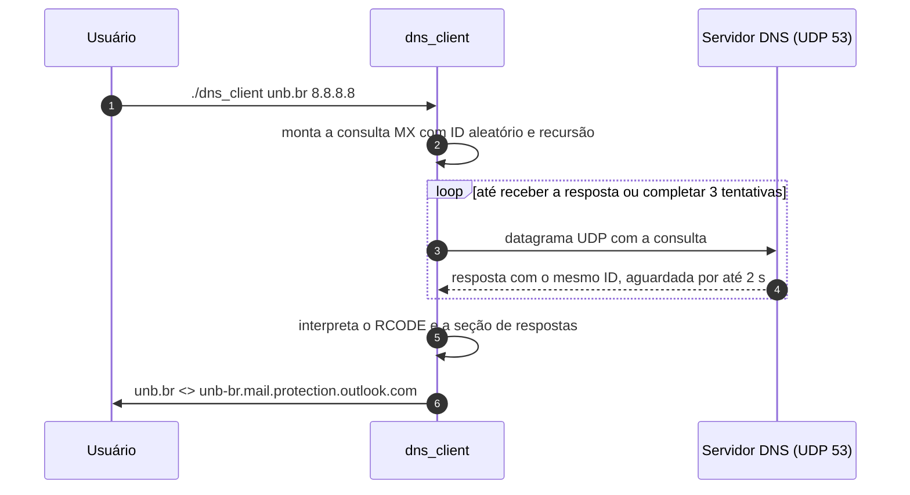
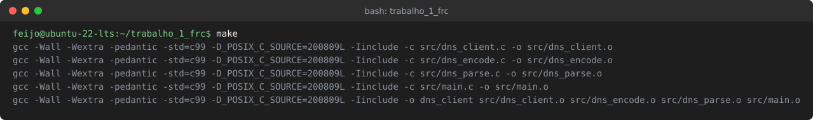
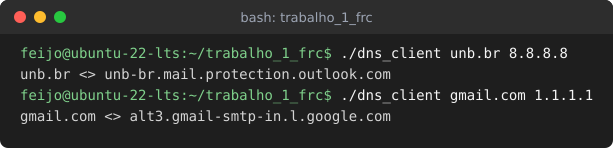
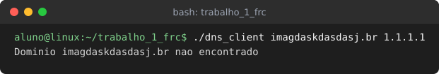
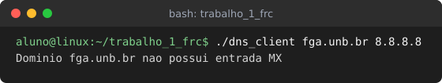
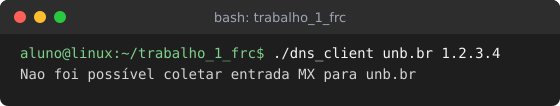
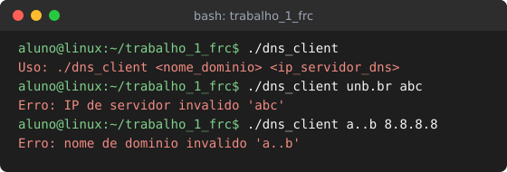

# Cliente DNS para Registros MX


Cliente de linha de comando, escrito em C, que descobre o servidor de e-mail de um domínio consultando seu registro MX diretamente em um servidor DNS. A mensagem de consulta é montada byte a byte e enviada por UDP, sem nenhuma biblioteca de resolução de nomes, de modo que todo o protocolo, da codificação do pedido à interpretação da resposta, fica visível no código.

Projeto desenvolvido como Trabalho 01 da disciplina **Fundamentos de Redes de Computadores**, ministrada pelo Prof. Tiago Alves na Universidade de Brasília, Faculdade do Gama.

## Integrantes

<table align="center">
  <tr>
    <td align="center" width="25%">
      <a href="https://github.com/CaioSoandrd">
        <br>
        <sub><b>Caio Soares de Andrade</b></sub>
      </a><br>
      <sub>232014638</sub>
    </td>
    <td align="center" width="25%">
      <a href="https://github.com/Pedrovargas10">
        <br>
        <sub><b>Pedro Felipe Silva Vargas</b></sub>
      </a><br>
      <sub>231039178</sub>
    </td>
    <td align="center" width="25%">
      <a href="https://github.com/Lucas-Ricarte">
        <br>
        <sub><b>Lucas Machado Peres Ricarte</b></sub>
      </a><br>
      <sub>232014093</sub>
    </td>
    <td align="center" width="25%">
      <a href="https://github.com/vitorfleonardo">
        <br>
        <sub><b>Vitor Feijó Leonardo</b></sub>
      </a><br>
      <sub>221008516</sub>
    </td>
  </tr>
</table>

## Sumário

1. [Visão geral](#visão-geral)
2. [Sistema operacional](#sistema-operacional)
3. [Ambiente de desenvolvimento](#ambiente-de-desenvolvimento)
4. [Estrutura do projeto](#estrutura-do-projeto)
5. [Como construir](#como-construir)
6. [Como executar](#como-executar)
7. [Telas e instruções de uso](#telas-e-instruções-de-uso)
8. [Funcionamento interno](#funcionamento-interno)
9. [Limitações conhecidas](#limitações-conhecidas)
10. [Referências](#referências)

## Visão geral

O DNS é o serviço de diretório da Internet: um banco de dados distribuído e hierárquico, acessado por um protocolo da camada de aplicação que roda sobre UDP na porta 53, cuja função mais conhecida é traduzir nomes em endereços IP. Cada informação desse banco é guardada em um registro de recurso, e o registro do tipo **MX** associa um domínio ao nome canônico do servidor que recebe seus e-mails, permitindo que `fulano@unb.br` seja entregue a uma máquina com nome bem diferente de `unb.br` (Kurose e Ross, cap. 2).

Este cliente faz o papel do hospedeiro que pergunta: recebe um domínio e o IP de um servidor DNS, envia uma única consulta do tipo MX pedindo recursão, ou seja, delegando ao servidor o trabalho de percorrer a hierarquia, e imprime o primeiro servidor de e-mail encontrado na resposta.



## Sistema operacional

O desenvolvimento e todos os testes foram feitos no **Linux**, na distribuição **Ubuntu 24.04 LTS**. O código depende apenas da biblioteca padrão do C e da API POSIX de sockets (`socket`, `sendto`, `recv`, `poll`), por isso deve compilar sem alterações em outros sistemas compatíveis com POSIX, embora só o Linux tenha sido validado.

## Ambiente de desenvolvimento

| Item | Ferramenta |
| :--- | :--- |
| Editor | Visual Studio Code |
| Linguagem | C, padrão C99 com extensões POSIX.1-2008 |
| Compilador | GCC 13.3.0 |
| Automação de build | GNU Make 4.3 |
| Ferramentas de apoio | `dig` e `tcpdump`, usados para conferir respostas e inspecionar os pacotes |

## Estrutura do projeto

```text
trabalho_1_frc/
├── include/
│   ├── dns_client.h    interface pública da consulta
│   ├── dns_encode.h    montagem da mensagem de consulta
│   ├── dns_parse.h     interpretação da mensagem de resposta
│   └── dns_types.h     constantes, resultados e leitura de campos de 16 bits
├── src/
│   ├── main.c          linha de comando e mensagens ao usuário
│   ├── dns_client.c    socket UDP, temporização e retransmissão
│   ├── dns_encode.c    cabeçalho, nome codificado, tipo MX e classe IN
│   └── dns_parse.c     RCODE, registros de resposta e compressão de nomes
├── docs/img/           imagens de demonstração
├── Makefile
└── readme.md
```

Cada módulo cuida de uma etapa da consulta, e somente `main.c` escreve na tela, o que mantém a lógica do protocolo separada da apresentação dos resultados.

## Como construir

São necessários apenas o GCC e o Make, que no Ubuntu vêm juntos no pacote `build-essential`:

```bash
sudo apt install build-essential
```

Na raiz do projeto, um único comando compila os módulos e gera o executável `dns_client`:

```bash
make
```



O Makefile compila com `-Wall -Wextra -pedantic` para que qualquer aviso do compilador apareça, e o projeto compila sem nenhum. A flag `-std=c99` fixa o padrão da linguagem, e `-D_POSIX_C_SOURCE=200809L` torna visíveis as funções POSIX que esse modo estrito esconderia. Para compilar sem o Make, o comando equivalente é:

```bash
gcc -Wall -Wextra -pedantic -std=c99 -D_POSIX_C_SOURCE=200809L -Iinclude -o dns_client src/*.c
```

Para apagar os objetos e o executável, use `make clean`.

## Como executar

```bash
./dns_client <nome_dominio> <ip_servidor_dns>
```

| Parâmetro | Descrição | Exemplo |
| :--- | :--- | :--- |
| `nome_dominio` | Domínio cujo registro MX será consultado | `unb.br` |
| `ip_servidor_dns` | Endereço IPv4 do servidor DNS, sempre contatado na porta UDP 53 | `8.8.8.8` |

O resultado de cada consulta ocupa uma única linha, e o código de saída permite usar o programa em scripts:

| Situação | Saída | Código de saída |
| :--- | :---: | :---: |
| Registro MX encontrado | `stdout` | `0` |
| Domínio inexistente | `stdout` | `0` |
| Domínio sem registro MX | `stdout` | `0` |
| Servidor sem resposta ou com erro | `stdout` | `1` |
| Argumentos, IP ou domínio inválidos | `stderr` | `1` |

## Telas e instruções de uso

### Consulta bem-sucedida

Quando o servidor devolve ao menos um registro MX, o programa imprime o domínio e o servidor de e-mail separados por `<>`.



No caso do `gmail.com`, que publica cinco registros MX com prioridades diferentes, o servidor exibido é o primeiro da resposta, e como a ordem dos registros varia entre consultas o nome pode mudar a cada execução.

### Domínio inexistente

Se o domínio não existe, o servidor responde com `RCODE = 3` (NXDOMAIN) e o cliente informa que ele não foi encontrado.



### Domínio sem registro MX

Um domínio pode existir e não receber e-mails. Nesse caso a resposta chega sem erro (`RCODE = 0`), mas sem nenhum registro MX entre as respostas.



### Servidor sem resposta

Quando o endereço informado não responde, o cliente espera 2 segundos por tentativa, reenvia a consulta e desiste após a terceira, o que leva cerca de 6 segundos no total. A mesma mensagem aparece quando o servidor responde com um erro diferente de NXDOMAIN, como `SERVFAIL`, ou envia uma resposta malformada.



### Erros de uso

Número errado de argumentos, IP em formato inválido e domínio com rótulo vazio ou longo demais são rejeitados antes de qualquer envio, com a mensagem na saída de erro.



## Funcionamento interno

### Montagem da consulta

Toda mensagem DNS começa com um cabeçalho fixo de 12 bytes, seguido das seções de perguntas e de registros (RFC 1035, seção 4.1). Os valores enviados seguem exatamente o que o enunciado exige:

| Campo | Tamanho | Valor | Significado |
| :--- | :---: | :---: | :--- |
| ID | 16 bits | aleatório | Identifica a transação e associa a resposta à consulta |
| Flags | 16 bits | `0x0100` | Consulta padrão com o bit RD ligado, pedindo recursão |
| QDCOUNT | 16 bits | `0x0001` | Uma pergunta |
| ANCOUNT | 16 bits | `0x0000` | Nenhuma resposta |
| NSCOUNT | 16 bits | `0x0000` | Nenhum registro de autoridade |
| ARCOUNT | 16 bits | `0x0000` | Nenhum registro adicional |

Na pergunta, o domínio é codificado como uma sequência de rótulos, cada um precedido do seu tamanho e o último seguido de um byte zero, e depois vêm o tipo MX (15) e a classe IN (1). A consulta real gerada para `unb.br`, com o ID fixado em `0x3A7F` apenas para o exemplo, tem 24 bytes:

```text
00000000: 3a7f 0100 0001 0000 0000 0000 0375 6e62  :............unb
00000010: 0262 7200 000f 0001                      .br.....
```

Os doze primeiros bytes são o cabeçalho da tabela acima, `03 75 6e 62 02 62 72 00` representa `3unb2br0`, e `000f 0001` fecha a pergunta com o tipo e a classe.

### Transporte e retransmissão

O UDP não estabelece conexão nem garante entrega, e por isso o próprio cliente precisa lidar com datagramas perdidos (Kurose e Ross, cap. 3). Depois de cada envio, `poll` aguarda a chegada de dados até um prazo de 2 segundos; datagramas com ID diferente do esperado são descartados sem reiniciar esse prazo, e se ele se esgota a mesma consulta é reenviada, até o limite de três tentativas.

### Interpretação da resposta

A resposta é analisada em três passos. Primeiro o campo RCODE do cabeçalho separa domínio inexistente, erro do servidor e sucesso. Em seguida a pergunta, que o servidor devolve junto com a resposta, é saltada. Por fim, os registros da seção de respostas são percorridos até o primeiro do tipo MX, cujo campo de dados traz 2 bytes de preferência e o nome do servidor de e-mail.

Esse nome quase sempre vem comprimido: para economizar espaço, o servidor substitui o final repetido de um nome por um ponteiro de 2 bytes, marcado pelos dois bits mais altos ligados, que indica onde aquele trecho já apareceu no pacote (RFC 1035, seção 4.1.4). O cliente segue esses ponteiros aceitando apenas os que apontam para trás, o que impede laços infinitos, e confere os limites do pacote antes de cada leitura, de modo que uma resposta truncada ou malformada é recusada sem acessar memória fora do buffer.

## Limitações conhecidas

- **Somente registros MX**, conforme o escopo do enunciado; os demais tipos, como A, AAAA e TXT, não são consultados.
- **Somente IPv4**: o servidor DNS precisa ser informado por um endereço IPv4, e não são aceitos IPv6 nem nomes de host.
- **Um único servidor de e-mail é exibido**: quando há vários registros MX, o programa mostra o primeiro da resposta sem considerar a preferência, que é o critério real de escolha entre eles.
- **Mensagens de até 512 bytes**: o cliente não usa EDNS0 e ignora o bit TC, que indica resposta truncada, então não repete a consulta por TCP como as RFCs preveem para respostas grandes.
- **Parâmetros fixos**: o tempo de espera de 2 segundos e o limite de 3 tentativas não podem ser alterados pela linha de comando.
- **Validação parcial do domínio**: são verificados apenas os limites de tamanho da RFC 1035, até 63 bytes por rótulo e 253 caracteres no total, sem checar os caracteres permitidos.
- **Sem proteções de segurança**: o ID vem de `rand()`, que é previsível, a origem da resposta não é conferida além do ID e não há verificação DNSSEC, o que deixa o cliente exposto a respostas forjadas.
- **Sem suporte nativo ao Windows**, cuja API de sockets (Winsock) é diferente da POSIX usada no projeto.

## Referências

- KUROSE, James F.; ROSS, Keith W. *Redes de computadores e a Internet: uma abordagem top-down*. São Paulo: Pearson. Capítulo 2, seção "DNS: o serviço de diretório da Internet", e capítulo 3, seção "Transporte não orientado para conexão: UDP".
- MOCKAPETRIS, P. [RFC 1034: Domain Names, Concepts and Facilities](https://www.rfc-editor.org/rfc/rfc1034). IETF, 1987.
- MOCKAPETRIS, P. [RFC 1035: Domain Names, Implementation and Specification](https://www.rfc-editor.org/rfc/rfc1035). IETF, 1987.
- MITCHELL, Mark; OLDHAM, Jeffrey; SAMUEL, Alex. *Advanced Linux Programming*. New Riders, 2001.
